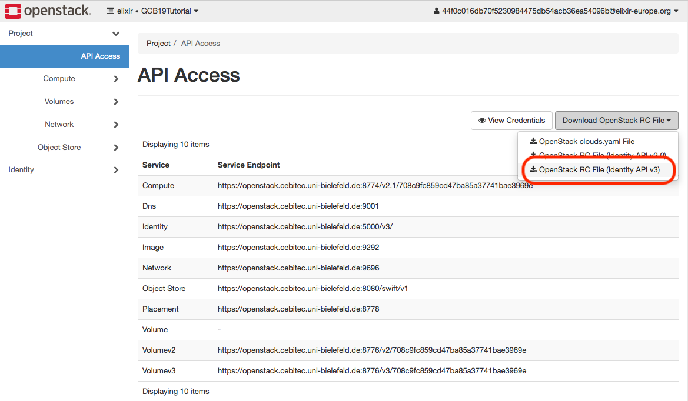
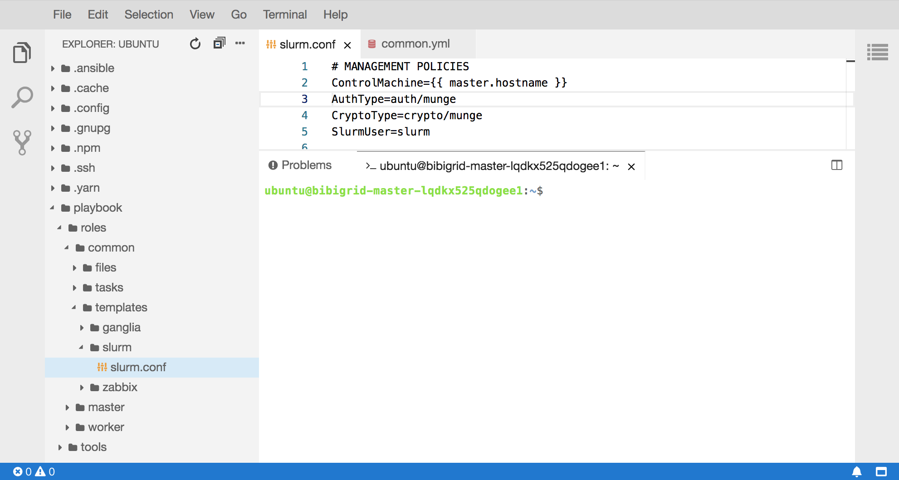

#  GCB 2019 - BiBiGrid HandsOn 


This tutorial is cloned from [de.NBI Wiki](https://cloud.denbi.de/wiki/Tutorials/BiBiGrid/) and reduced/optimized for the HandsOn session at the **2nd de.NBI cloud user meeting in Heidelberg, 2019** .

## Prerequisites


- Java 8+ (required)
- Openstack API access (required)
- Openstack CLI installed (recommend)


## Download Binary


If you don't want to build the client from sources you can [download a prebuilt binary](http://bibiserv.cebitec.uni-bielefeld.de/resources/bibigrid). It is always recommend to choose the latest one.


## Configuration

The goal of this session is to setup a small HPC cluster consisting of 3 nodes  (1 master, 2 workers) with basic service on top of Ubuntu 18.04 using BiBiGrid.
Basic Services means BiBiGrid provides a **shared file system** between all nodes and setup a **Slurm** cluster. For easy access we also install **Theia** (a Web-IDE), which is the most time consuming task in our setup.

This tutorial targets users running BiBigrid on the de.NBI cloud site in Bielefeld. Depending on the cloud site (Berlin, Bielefeld, DKFZ, Giessen, Heidelberg or Tübingen) the usage of BiBiGrid differs a bit.

See our [de.NBI Wiki HandsOn](https://cloud.denbi.de/wiki/Tutorials/BiBiGrid/) for a more general tutorial.
### Template

Use the prefilled [template](resources/bibigrid.yml) as base for your BiBiGrid configuration. You can use the openstack cli or access openstack dashboard to fetch the necessary information from your project. 

### Credentials

Download an Openstack RC file using the Openstack Dashboard:

-  left side menu 
-  Project 
-  API access 
-  right side drop down button _Download Openstack RC File_ 
-  download Openstack RC File (Identity API v3) 



You have to source the RC file in a terminal where later BiBiGrid is executed.

```
$ source GCB19Tutorial-openrc.sh

```


### Access
If not already done, you have to create an ssh key pair, upload your public key to Openstack and give it a name. BiBiGrid supports password protected keys using an ssh agent.

```
sshPrivateKeyFile: path/to/private/key
sshPublicKeyFile: path/to/public/key
keypair : name_of_the_uploaded_keypair
``` 
You have to give the *full path* to your private and public key here. The keypair value is the name of the uploaded public key.

#### ssh-user

The ssh-user depends on the cloud image your cluster is based on. Since we run on top of Ubuntu 18.04 the ssh-user is *ubuntu*.

#### region

The region is can be determined easily by running the openstack cli.

```
$ openstack region list
```


#### availabilityZone

The availability zone where your instances are created.

```
$ openstack availability zone list
```

### Network
If you have the permissions to create networks, BiBiGrid offers the possibility to  create a new private network connected to an existing router. For our tutorial we work on an *existing subnet*. Determine the subnet name or id using the cli.


```
$ openstack subnet list
```


### Instances 

Get the id of the Ubuntu 18.04 image ...

```
$ openstack image list
```

... and add it to the master/worker configuration.


#### master

```
masterInstance:
  type: de.NBI mini + ephemeral
  image: image_id_of_Ubuntu_18.04
```

Select a flavor type for the master node. A list of usable flavors can be optained by openstack cli.

```
$ openstack flavor list
```


#### worker

```
workerInstances:
  - type: de.NBI large + ephemeral
    count: 2
    image: image_id_of_Ubuntu_18.04
```

Choose the number of worker nodes to be started. BiBiGrid supports to start different type workers in a single grid. It is not guaranted that everything works if mix up different image types in a single cluster. 

### Services

As mentioned before our cluster is very basic. That means we have to enable a shared fs (**nfs**), a grid batch scheduler (**slurm**) and a web-ide (**theia**).
Theia is build from sources. This is a time consuming task, depending of your master instance type and the real hardware behind it this takes some time.

Since our demo cluster is small we let the master also do some work (enable *useMasterAsCompute*).


### Verify your configuration.

You can simply check your configuration using :

`java -jar bibigrid-openstack-2.0.8.jar -ch -o bibigrid.yml`


## Start the Cluster

`java  -jar bibigrid-openstack-2.0.8.jar -c -o bibigrid.yml`

or more verbose:

`java -jar bibigrid-openstack-2.0.8.jar -c -v -o bibigrid.yml`

or in debug mode:

`java  -jar bibigrid-openstack-2.0.8.jar -c -v -d -o bibigrid.yml`

Starting with blank Ubuntu 18.04 images takes up to 15 minutes to finish, depending on the cloud performance and bibigrid configuration.


## Good to know

- `/vol/spool` -> shared filesystem between all nodes.
- `/vol/scratch` -> local diskspace (ephemeral disk, if provided)


## Login into the Cluster

After a successful setup ... 

```
SUCCESS: Master instance has been configured. 
Ok : 
 You might want to set the following environment variable:

export BIBIGRID_MASTER=XXX.XXX.XXX.XXX

You can then log on the master node with:

ssh -i /path/to/private/ssh-key ubuntu@$BIBIGRID_MASTER

The cluster id of your started cluster is: vnqtbvufr3uovci

You can easily terminate the cluster at any time with:
./bibigrid -t XXX 

```
... you can login into the master node. Run `sinfo` 
to check if there are 3 execution nodes available.

## List running Cluster

Since it is possible to start more than one cluster at once, it is possible to list all running clusters: 

`java  -jar bibigrid-openstack-2.0.8.jar -l`

The command returns an informative list about all your running clusters.


## Web IDE (Theia)

[Theia](https://www.theia-ide.org/) is a Web-IDE that allows a more comfortable way to work with your cloud instances. Let's see how this works together with BiBiGrid. 



If the theia option is enabled in the configuration, theia will be run as systemd service on localhost. For security reasons, theia is not binding to a standard network device. A valid certificate and some kind of authentication is needed to create a safe connection, which is not that easy in a dynamic cloud environment. 


However, Bibigrid has the possibility to open a ssh tunnel from the local machine to bibigrids master instance and open up a browser window/tab running theia web ide. 

`java -jar bibigrid-openstack-2.0.8.jar --ide <clusterid>`


## Hello World, Hello BiBiGrid!

After successful starting a cluster in the cloud, start with a typical example : *Hello World !*

- Connect to your cluster using the Web-IDE
`
java ${JAVA_OPTS} -jar bibigrid-openstack-2.0.8.jar --ide <clusterid>
`

- Create a new shell script `helloworld.sh` in the spool directory (`/vol/spool`):

```
#!/bin/bash
echo Hello from $(hostname) !
sleep 10
```

- Open a terminal and change into the spool directory. 
`cd /vol/spool`

- Make our helloworld script executable:
`chmod u+x helloworld.sh`

- Submit this script as array job 50 times : `sbatch --array=1-50 --job-name=helloworld hello-world.sh `
- See the status of our cluster: `squeue`
- See the output: `cat slurm-*.out`

## Terminate a cluster

Terminating a running cluster is quite simple :

`java ${JAVA_OPTS} -jar bibigrid-openstack-2.0.8.jar -t <clusterid>`


